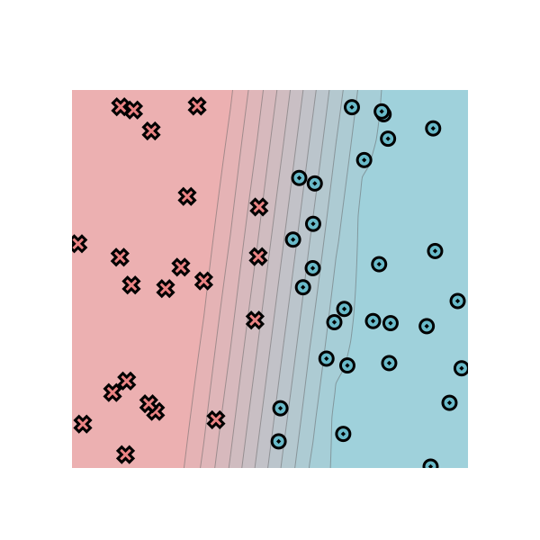
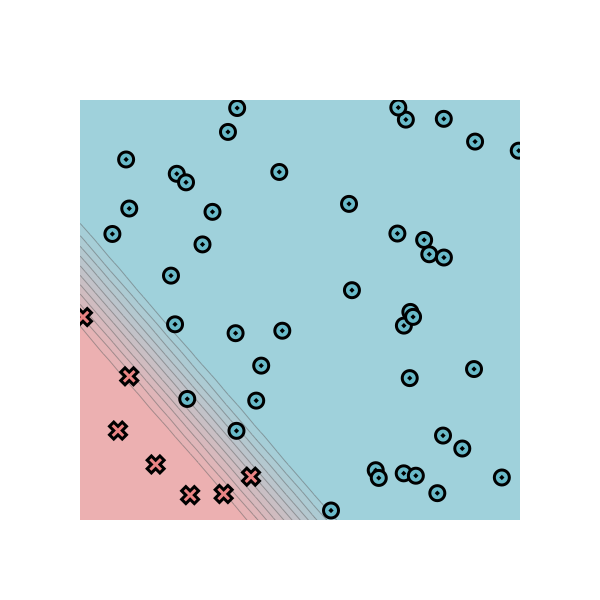
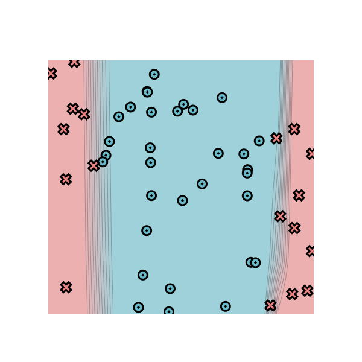
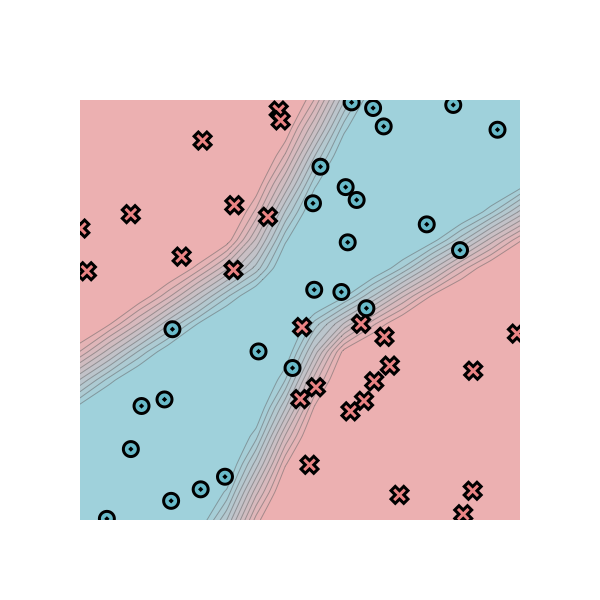
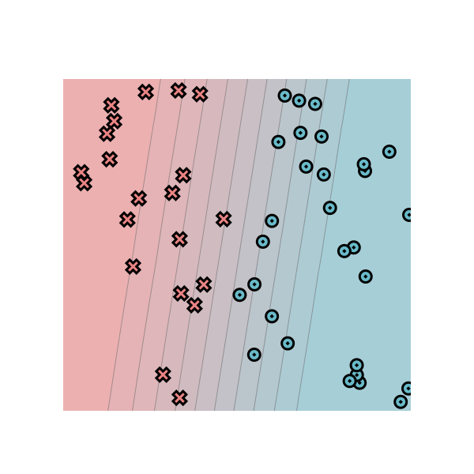
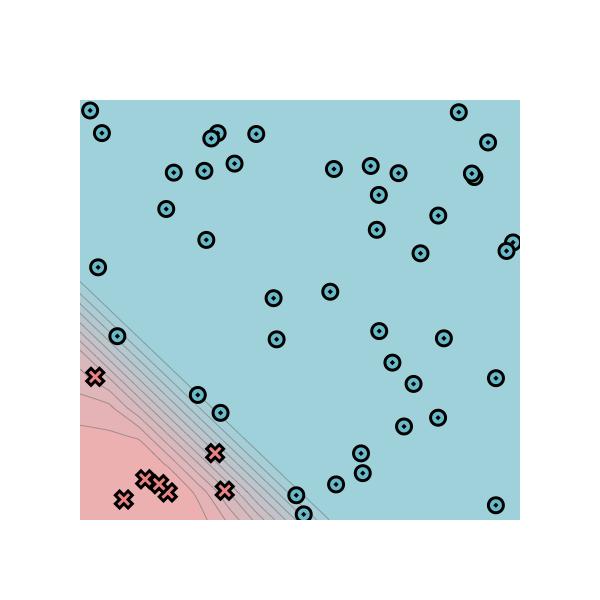
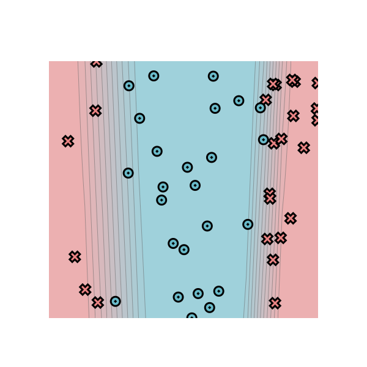
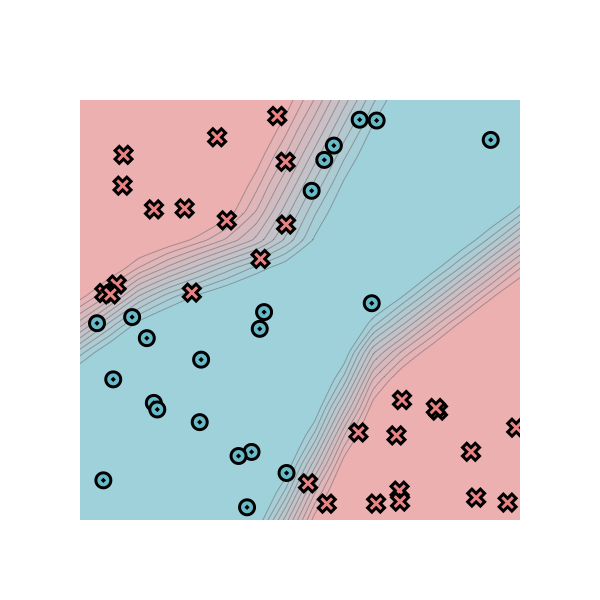

# minitorch
The full minitorch student suite. 

To access the autograder: 

* Module 0: https://classroom.github.com/a/qDYKZff9
* Module 1: https://classroom.github.com/a/6TiImUiy
* Module 2: https://classroom.github.com/a/0ZHJeTA0
* Module 3: https://classroom.github.com/a/U5CMJec1
* Module 4: https://classroom.github.com/a/04QA6HZK
* Quizzes: https://classroom.github.com/a/bGcGc12k

## Module 0 visualization

Dataset: `Simple`

Manual classifier parameters:

* `weight_0_0 = -10`
* `weight_1_0 = 0.67`
* `bias_0 = 4.47`

These parameters implement the decision boundary `x = 0.5`.

## Module 1 — Training results

### Simple

Training parameters:

* Points: 50
* Hidden layers: 2
* Learning rate: 0.1
* Epochs: 500

After 10 iterations, the loss was `37.06847641923458` and `21/50` objects were classified correctly.

Final loss: `12.591894808722811`  
Final correct: `50/50`

### Diag

Training parameters:

* Points: 50
* Hidden layers: 4
* Learning rate: 0.05
* Epochs: 1000

After 10 epochs, the loss was `28.829999191377475` and `43/50` objects were classified correctly.

Final loss: `4.257752517110073`  
Final correct: `49/50`

### Split

Training parameters:

* Points: 50
* Hidden layers: 3
* Learning rate: 0.1
* Epochs: 2000

After 10 epochs, the loss was `36.2130477602129` and `15/50` objects were classified correctly.

Final loss: `3.517079592786552`  
Final correct: `49/50`

### Xor

Training parameters:

* Points: 50
* Hidden layers: 7
* Learning rate: 0.05
* Epochs: 1500

After 10 epochs, the loss was `35.038760771491376` and `29` objects were classified correctly.

Final loss: `9.924160815918189`  
Final correct: `49/50`

## Module 2 — Training results

### Simple

Training parameters:

* Points: 50
* Hidden layer size: 2
* Learning rate: 0.1
* Epochs: 500
* Time per epoch: 0.090 s

After 10 epochs, the loss was `34.98646467006687` and `16/50` objects were classified correctly.

Final loss: `19.002294354450367`

Final correct: `50/50`

### Diag

Training parameters:

* Points: 50
* Hidden layer size: 4
* Learning rate: 0.05
* Epochs: 1000
* Time per epoch: 0.198 s

After 10 epochs, the loss was `22.015871427383765` and `43/50` objects were classified correctly.

Final loss: `4.490139411955518`

Final correct: `49/50`

### Split

Training parameters:

* Points: 50
* Hidden layer size: 4
* Learning rate: 0.05
* Epochs: 1000
* Time per epoch: 0.187 s

After 10 epochs, the loss was `35.840728205031674` and `25/50` objects were classified correctly.

Final loss: `11.255814898106498`

Final correct: `48/50`

### Xor

Training parameters:

* Points: 50
* Hidden layer size: 8
* Learning rate: 0.05
* Epochs: 1500
* Time per epoch: 0.509 s

After 10 epochs, the loss was `35.87986259120219` and `28/50` objects were classified correctly.

Final loss: `10.278114251859376`

Final correct: `46/50`

