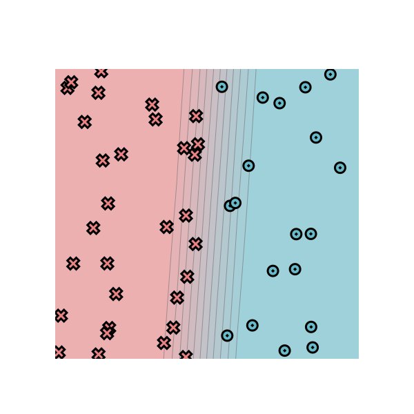

# minitorch
The full minitorch student suite. 

To access the autograder: 

* Module 0: https://classroom.github.com/a/qDYKZff9
* Module 1: https://classroom.github.com/a/6TiImUiy
* Module 2: https://classroom.github.com/a/0ZHJeTA0
* Module 3: https://classroom.github.com/a/U5CMJec1
* Module 4: https://classroom.github.com/a/04QA6HZK
* Quizzes: https://classroom.github.com/a/bGcGc12k

## Module 0 visualization

Dataset: `Simple`

Manual classifier parameters:

* `weight_0_0 = -10`
* `weight_1_0 = 0.67`
* `bias_0 = 4.47`

These parameters implement the decision boundary `x = 0.5`.

